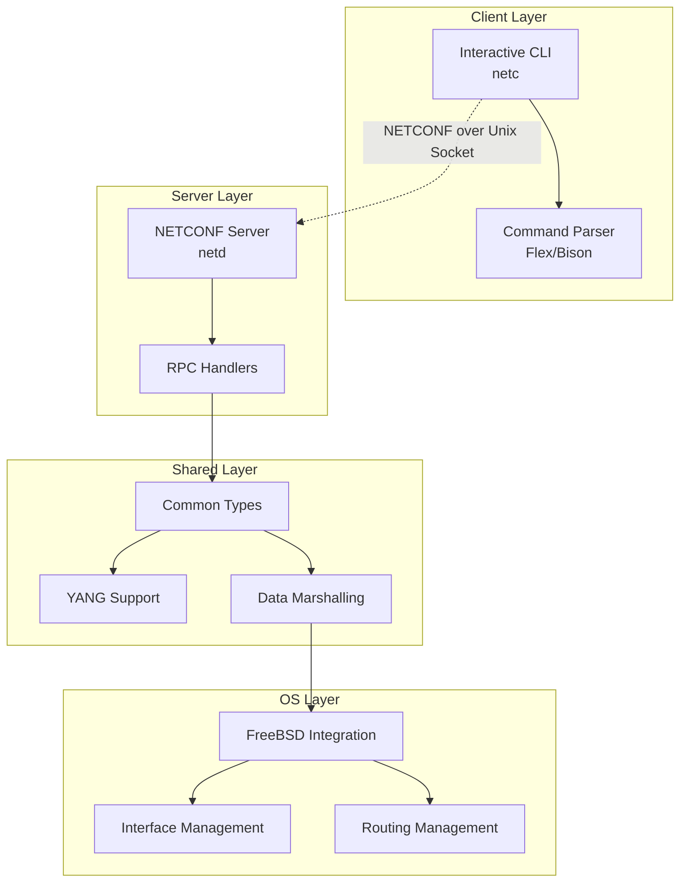
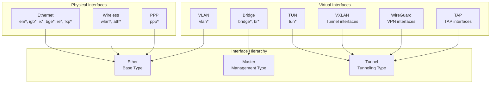
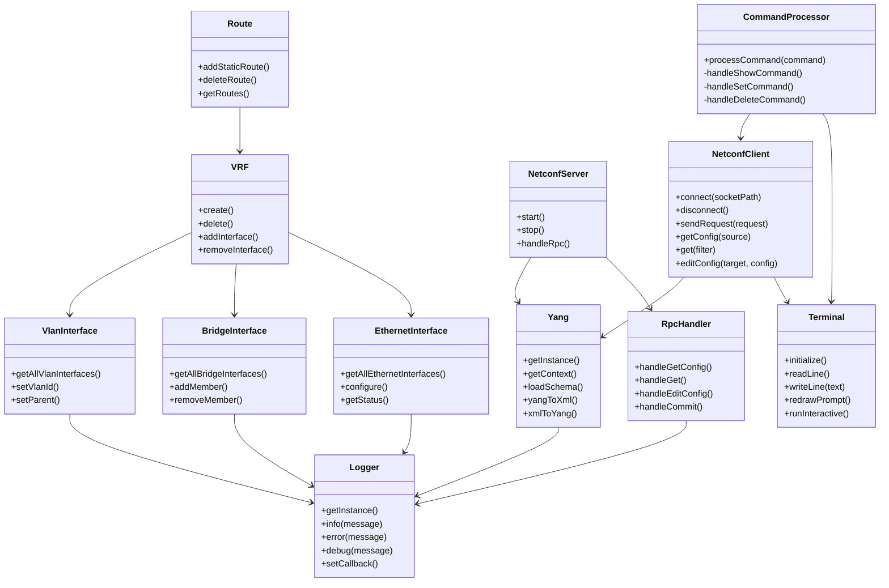
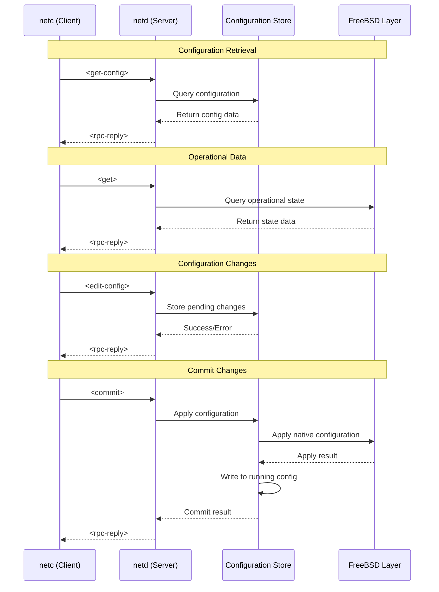
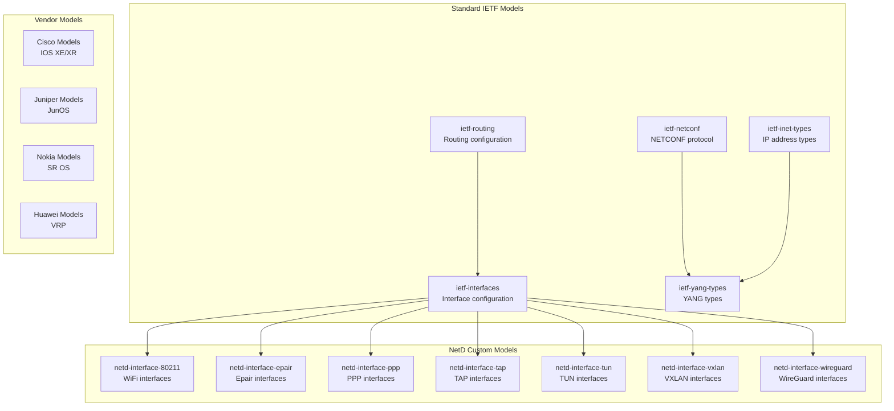

# NetD - Network Configuration Daemon

NetD is a modern network configuration daemon for FreeBSD that provides NETCONF-based network management with a CLI interface. It offers a clean separation between configuration management and the underlying operating system, making it suitable for both traditional network equipment and modern software-defined networking environments.

## What is NETCONF?

**NETCONF (Network Configuration Protocol)** is an IETF standard (RFC 6241) that provides a standardized way to install, manipulate, and delete the configuration of network devices. It was developed by the Internet Engineering Task Force (IETF) to address the limitations of traditional network management protocols like SNMP.

### Why NETCONF?

NETCONF offers several advantages over traditional network management approaches:

- **Standardized Protocol**: IETF-standardized protocol ensures interoperability across different vendors and devices
- **YANG Data Modeling**: Uses YANG (Yet Another Next Generation) for data modeling, providing strong typing and validation
- **Transaction-based**: Supports atomic configuration changes with rollback capabilities
- **Separation of Concerns**: Clear separation between configuration data, operational data, and state data
- **Modern Architecture**: Designed for modern network automation and software-defined networking
- **Industry Adoption**: Widely adopted by major network equipment vendors (Cisco, Juniper, Nokia, Huawei, etc.)

### IETF's Role

The IETF has been instrumental in developing and maintaining NETCONF:

- **RFC 6241**: Defines the core NETCONF protocol
- **RFC 6020**: Defines the YANG data modeling language
- **RFC 6242**: Defines NETCONF over SSH
- **RFC 8071**: Defines NETCONF over TLS
- **Ongoing Work**: Continuous development of new YANG models and protocol extensions

NETCONF represents the IETF's vision for modern network management, providing a robust foundation for network automation, configuration management, and operational monitoring.

## Features

- **NETCONF Server**: Full NETCONF 1.1 implementation with YANG data modeling
- **Interactive CLI**: Curses-based command-line interface with command completion
- **FreeBSD Integration**: Native FreeBSD interface and routing management
- **Modular Architecture**: Clean separation between shared types, OS-specific implementations, and server logic
- **YANG Support**: Comprehensive YANG schema support with libyang integration
- **Type Safety**: Strongly-typed C++ implementation with comprehensive error handling

## Architecture

NetD follows a layered architecture:



### Components

- **`netd`**: The main server daemon that provides NETCONF services
- **`netc`**: The client CLI application for interactive configuration
- **Shared Layer**: Common types, YANG support, and marshalling logic
- **FreeBSD Layer**: OS-specific interface and routing management
- **Parser**: Flex/Bison-based command parser for the CLI

## Supported Interface Types

NetD supports a comprehensive range of network interface types:



### Interface Type Details

- **Physical Interfaces**: Direct hardware interfaces
- **Virtual Interfaces**: Software-created interfaces
- **Interface Hierarchy**: Three base types for different interface categories

## Installation

### Prerequisites

- FreeBSD 13.0 or later
- CMake 3.16 or later
- libyang and libnetconf2 development packages
- Flex and Bison for parser generation

### Building

```bash
# Clone the repository
git clone <repository-url>
cd netd

# Create build directory
mkdir build && cd build

# Configure with CMake
cmake ..

# Build the project
make

# Install (optional)
sudo make install
```

### Dependencies

The following packages are required:

```bash
# On FreeBSD
pkg install cmake libyang libnetconf2 flex bison

# Development packages
pkg install libyang-dev libnetconf2-dev
```

## Usage

### Starting the Server

```bash
# Start the NetD server
sudo ./netd

# The server will listen on /var/run/netd.sock by default
```

### Using the Client

```bash
# Start the interactive CLI
./netc

# The client will connect to the server automatically
```

### Available Commands

#### Interface Management
```bash
# Show all interfaces
show interfaces

# Show specific interface
show interfaces em0

# Show interface with unit
show interfaces em0 unit 0

# Configure interface
set interfaces em0 unit 0 family inet address 192.168.1.1/24
set interfaces em0 description "Management interface"
```

#### Routing Configuration
```bash
# Show routing instances
show routing-instances

# Show routes
show route

# Configure static routes
set routing-options static route 0.0.0.0/0 next-hop 192.168.1.1
```

#### System Information
```bash
# Show system information
show version
show system uptime
show chassis

# Show ARP table
show arp
show arp no-resolve

# Show protocols
show protocols

# Show IPv6 neighbors
show ipv6 neighbors
```

#### Configuration Management
```bash
# Commit configuration changes
commit

# Edit configuration
edit interfaces em0 unit 0

# Delete configuration
delete interfaces em0 unit 0 family inet address 192.168.1.1/24
```

## Configuration

### Server Configuration

The server can be configured through command-line options:

```bash
# Custom socket path
./netd --socket /tmp/custom-netd.sock

# Custom YANG directory
./netd --yang-dir /usr/local/share/yang

# Enable debug logging
./netd --debug
```

### Client Configuration

The client automatically connects to the server. Configuration options:

```bash
# Connect to custom server socket
./netc --socket /tmp/custom-netd.sock

# Enable debug mode
./netc --debug
```

## YANG Models

NetD includes comprehensive YANG models for network configuration:

- **Standard IETF Models**: RFC-compliant models for interfaces, routing, and NETCONF
- **Custom Models**: NetD-specific models for advanced features
- **Vendor Models**: Support for vendor-specific extensions

YANG models are located in the `yang/` directory:

- `yang/standard/`: Standard IETF and IEEE models
- `yang/vendor/`: Vendor-specific models
- `shared/yang/`: NetD-specific models

## Development

### Project Structure



### Adding New Interface Types

1. **Define the model class** in `shared/include/interface/` - These classes provide platform-independent functionality including YANG serialization/deserialization (`toYang`/`fromYang`) and serve as data models for creating native interfaces
2. **Implement the FreeBSD-specific version** in `freebsd/src/interface/` - These classes handle native functionality including configuration acquisition and application via system calls
3. Add discovery functions to the FreeBSD layer
4. Update the server handlers to support the new type
5. Add YANG models if needed

### Adding New Commands

1. Add tokens to `client/parser/parser.l`
2. Add grammar rules to `client/parser/parser.y`
3. Implement command handlers in `client/src/main.cpp`
4. Add server-side support if needed

### Building from Source

```bash
# Debug build
cmake -DCMAKE_BUILD_TYPE=Debug ..
make

# Release build with optimizations
cmake -DCMAKE_BUILD_TYPE=Release ..
make

# Build specific components
make netd          # Server only
make netc          # Client only
make netd_shared   # Shared library only
```

## API Reference

### NETCONF Operations

NetD supports standard NETCONF operations:



**Supported Operations:**
All standard NETCONF operations are supported:
- **`<get-config>`**: Retrieve configuration data from the store
- **`<get>`**: Retrieve operational data from the system
- **`<edit-config>`**: Modify configuration (stored in candidate)
- **`<commit>`**: Commit candidate configuration to running
- **`<close-session>`**: Close NETCONF session
- **`<kill-session>`**: Terminate another session
- **`<lock>`**: Lock configuration datastore
- **`<unlock>`**: Unlock configuration datastore
- **`<validate>`**: Validate configuration
- **`<copy-config>`**: Copy configuration between datastores
- **`<delete-config>`**: Delete configuration datastore
- **`<discard-changes>`**: Discard uncommitted changes

### YANG Data Models

All configuration and operational data is modeled using YANG:



**Model Categories:**
- **Standard IETF Models**: RFC-compliant models for interfaces, routing, and NETCONF
- **NetD Custom Models**: NetD-specific interface extensions
- **Vendor Models**: Support for vendor-specific extensions

## Contributing

1. Fork the repository
2. Create a feature branch
3. Make your changes
4. Add tests if applicable
5. Submit a pull request


## License

NetD is licensed under the BSD 2-Clause License. See the [LICENSE](LICENSE) file for details.

## Support

- **Documentation**: See the `doc/` directory for detailed documentation
- **Issues**: Report bugs and feature requests via GitHub issues
- **Discussions**: Use GitHub discussions for questions and general discussion

## Roadmap

- [ ] Enhanced VXLAN and WireGuard support
- [ ] SCTP protocol support
- [ ] RESTCONF API support
- [ ] Configuration validation and rollback
- [ ] SNMP integration
- [ ] Web-based management interface
- [ ] Docker containerization
- [ ] Integration with network orchestration platforms

## Acknowledgments

- **libyang**: YANG data modeling library
- **libnetconf2**: NETCONF protocol implementation
- **FreeBSD**: The underlying operating system
- **IETF**: For NETCONF and YANG standards

---

**NetD** - Modern network configuration for FreeBSD
