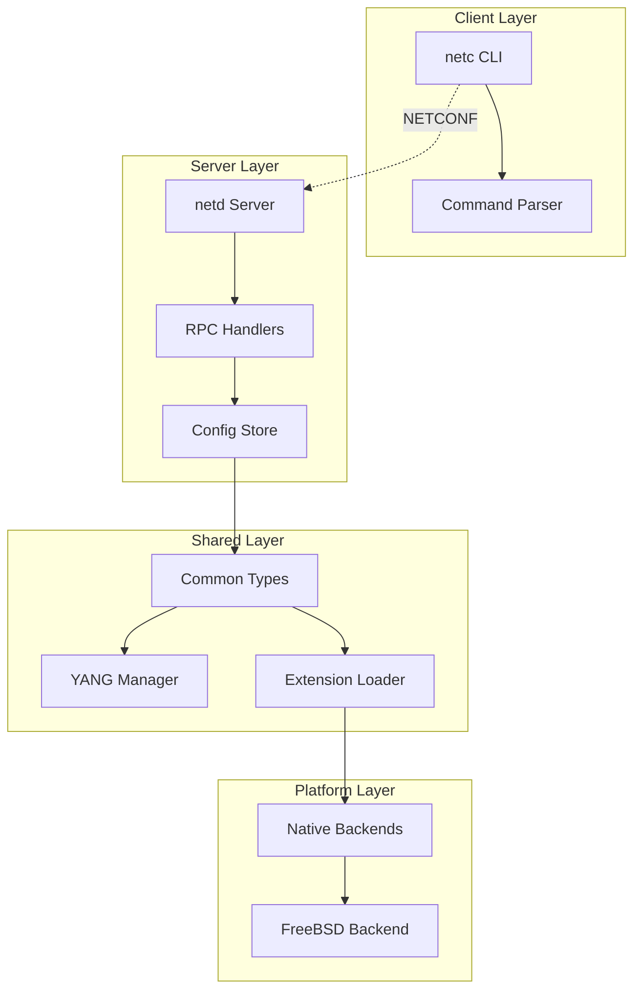

# NetD Development Guide

This document provides comprehensive information for developers working on NetD, including build system details, architecture overview, coding standards, and extension development.

## Table of Contents

- [Build System](#build-system)
- [Architecture Overview](#architecture-overview)
- [Coding Standards](#coding-standards)
- [Testing](#testing)
- [Debugging](#debugging)
- [Contributing](#contributing)

## Build System

### Prerequisites

- **FreeBSD 14.0+** or compatible system
- **CMake 3.16+**
- **Clang 18+** (preferred) or **GCC 11+** (fallback)
- **libyang** development packages
- **OpenSSL** development packages
- **ncurses** development packages (client only)
- **Git** (for build ID generation)

### Build Types

NetD supports two build types:

#### DEBUG Build (Default)
```bash
cmake -DCMAKE_BUILD_TYPE=DEBUG ..
make
```

Features:
- Full debug symbols (`-g3`)
- Development YANG directory access
- All debug logging enabled
- No optimization

#### RELEASE Build
```bash
cmake -DCMAKE_BUILD_TYPE=RELEASE ..
make
```

Features:
- Optimized code (`-O2`)
- Symbol stripping (`-s`)
- Production YANG directory only
- Requires clean git working directory

### Build Configuration

The build system automatically detects and configures:

- **Compiler Selection**: Prefers Clang 18+ over GCC 11+
- **Dependencies**: libyang, OpenSSL, ncurses, LLDP (optional)
- **Build ID**: Generated from git hash with `-dirty` suffix if uncommitted changes

### Installation Targets

```bash
# Install everything
make install

# Install specific components
make install_netc     # Client only
make install_shared   # Shared libraries and headers
make install_netd     # Server only
make install_yang     # YANG files only

# Uninstall
make uninstall
```

### FreeBSD Package Creation

```bash
# Create package metadata only
make freebsd_package_metadata

# Create complete package
make freebsd_package
```

## Architecture Overview

### Component Structure

```
netd/
├── client/          # Interactive CLI client
├── server/          # NETCONF server daemon
├── shared/          # Common libraries and types
├── freebsd/         # FreeBSD-specific implementations
├── yang/            # YANG model repository
└── doc/             # Documentation
```

### Key Components

#### Server (`netd`)
- NETCONF 1.1 protocol implementation
- YANG data modeling with libyang
- Configuration store management
- RPC handler framework

#### Client (`netc`)
- Interactive curses-based CLI
- Command parser (Flex/Bison)
- NETCONF client implementation
- Real-time configuration editing

#### Shared Library (`netd_shared`)
- Common data types and utilities
- YANG schema management
- Request/response handling
- Extension loading system

#### FreeBSD Layer (`freebsd/`)
- Native interface management
- Routing table operations
- System call wrappers
- Platform-specific implementations

### Data Flow



## Coding Standards

### C++ Standards

- **C++23** standard required
- **Clang-format** enforced formatting
- **Smart pointers** preferred over raw pointers
- **RAII** principles throughout

### Code Formatting

```bash
# Format all C++ files
find . -name "*.hpp" -o -name "*.cpp" | xargs clang-format19 --style=file -i
```

### Naming Conventions

- **Classes**: PascalCase (`NetdExtension`)
- **Functions**: camelCase (`getCapabilities`)
- **Variables**: snake_case (`extension_path`)
- **Constants**: UPPER_CASE (`EXTENSION_DIR`)
- **Namespaces**: snake_case (`netd::shared`)

### Error Handling

- Use `netd::shared::Exception` hierarchy
- Provide meaningful error messages
- Log errors with appropriate levels
- Use RAII for resource management

### Memory Management

```cpp
// Preferred: Smart pointers
std::unique_ptr<MyClass> obj = std::make_unique<MyClass>();
std::shared_ptr<MyClass> shared = std::make_shared<MyClass>();

// Avoid: Raw pointers
MyClass* obj = new MyClass(); // Don't do this
```

## Extension Development

### Extension System Overview

NetD supports loadable extensions for native backend implementations. Extensions are dynamically loaded shared libraries that provide OS-specific functionality.

### Extension Types

Currently supported:
- **`NATIVE_BACKEND`**: Native backend implementations for OS-specific functionality

### Creating an Extension

#### 1. Header Structure

```cpp
#include <netd/shared/extension.hpp>

class MyNativeBackend : public netd::shared::NetdExtension {
public:
    std::vector<netd::shared::ExtensionCapability> getCapabilities() const override;
    netd::shared::ExtensionInfo getInfo() const override;
    bool initialize() override;
    void cleanup() override;
    bool isCompatible(const std::string& netd_version) const override;
};
```

#### 2. Implementation

```cpp
std::vector<netd::shared::ExtensionCapability> MyNativeBackend::getCapabilities() const {
    return { netd::shared::ExtensionCapability::NATIVE_BACKEND };
}

netd::shared::ExtensionInfo MyNativeBackend::getInfo() const {
    return {
        "my-native-backend",
        "1.0.0",
        "My custom native backend",
        getCapabilities(),
        "Your Name",
        "BSD-2-Clause"
    };
}

bool MyNativeBackend::initialize() {
    // Initialize your backend
    return true;
}

void MyNativeBackend::cleanup() {
    // Cleanup resources
}

bool MyNativeBackend::isCompatible(const std::string& netd_version) const {
    // Check compatibility
    return true;
}
```

#### 3. Export Function

```cpp
extern "C" netd::shared::NetdExtension* createExtension() {
    return new MyNativeBackend();
}
```

#### 4. Build Configuration

```cmake
add_library(my_extension SHARED my_extension.cpp)
target_link_libraries(my_extension netd_shared)
target_include_directories(my_extension PRIVATE /usr/local/include)
set_target_properties(my_extension PROPERTIES PREFIX "")
```

### Extension Loading

Extensions are automatically loaded from:
- **Development**: `extensions/` (relative to current directory)
- **Production**: `/usr/local/lib/netd/extensions/`

### Extension Lifecycle

1. **Discovery**: NetD scans extension directories for `.so` files
2. **Loading**: Each extension is loaded with `dlopen()`
3. **Creation**: `createExtension()` function is called
4. **Compatibility**: Version compatibility is checked
5. **Initialization**: `initialize()` is called
6. **Runtime**: Extension provides functionality
7. **Cleanup**: `cleanup()` is called on shutdown

## Testing

### Unit Testing

```bash
# Run unit tests (when implemented)
make test
```

### Integration Testing

```bash
# Start server
sudo ./netd --debug

# Test client connection
./netc
```

### Debug Testing

```bash
# Enable debug logging
./netd -d --debug-lldp --debug-yang

# Enable trace logging
./netd -dd
```

## Debugging

### Debug Options

```bash
# Basic debug output
./netd -d

# Debug + trace output
./netd -dd

# LLDP debug output
./netd --debug-lldp

# YANG debug output
./netd --debug-yang

# Quiet mode (errors only)
./netd -q
```

### Logging Levels

- **ERROR**: Critical errors that prevent operation
- **WARNING**: Non-critical issues that should be noted
- **INFO**: General information about operation
- **DEBUG**: Detailed debugging information
- **TRACE**: Very detailed execution tracing

### Common Debug Scenarios

#### YANG Schema Issues
```bash
./netd --debug-yang -l  # List available YANG modules
```

#### LLDP Problems
```bash
./netd --debug-lldp     # Enable LLDP debugging
```

#### Extension Loading
```bash
./netd -d               # Check extension loading in debug output
```

## Contributing

### Development Workflow

1. **Fork** the repository
2. **Create** a feature branch
3. **Implement** your changes
4. **Test** thoroughly
5. **Format** code with clang-format
6. **Submit** a pull request

### Code Review Process

- All changes require review
- Tests must pass
- Code must be formatted
- Documentation must be updated

### Commit Messages

Use clear, descriptive commit messages:

```
Add LLDP custom TLV support

- Implement custom TLV management
- Add OUI-based TLV filtering
- Support for multiple TLV types
```

### Pull Request Guidelines

- **Title**: Clear description of changes
- **Description**: Detailed explanation of what was changed and why
- **Testing**: Describe how changes were tested
- **Breaking Changes**: Note any breaking changes

### Documentation

- Update relevant documentation
- Add examples for new features
- Update API documentation
- Include usage examples

## Build System Details

### CMake Modules

- `cmake/GetGitRevisionDescription.cmake`: Git revision handling
- `cmake/GetBuildType.cmake`: Build type validation
- `cmake/FreeBSDPackage.cmake`: FreeBSD package generation

### Compiler Detection

The build system automatically detects and configures the best available compiler:

```cmake
# Prefer Clang 18+ over GCC 11+
if(CLANG_CXX_COMPILER AND CLANG_C_COMPILER)
    set(CMAKE_CXX_COMPILER ${CLANG_CXX_COMPILER})
elseif(GCC_CXX_COMPILER AND GCC_C_COMPILER)
    set(CMAKE_CXX_COMPILER ${GCC_CXX_COMPILER})
endif()
```

### Dependency Management

Dependencies are managed through pkg-config:

```cmake
pkg_check_modules(LIBYANG REQUIRED libyang)
pkg_check_modules(OPENSSL REQUIRED openssl)
pkg_check_modules(NCURSES REQUIRED ncurses)
```

### Conditional Compilation

Features are conditionally compiled based on available dependencies:

```cpp
#ifdef HAVE_LLDP
    // LLDP-specific code
#endif

#ifdef HAVE_OPENSSL
    // TLS/DTLS code
#endif
```

## Troubleshooting

### Common Build Issues

#### Missing Dependencies
```bash
# Install required packages
pkg install cmake libpcre2 openssl ncurses

# Build libyang from source
git clone https://github.com/CESNET/libyang.git
cd libyang && mkdir build && cd build
cmake .. && make && sudo make install
```

#### Compiler Issues
```bash
# Check compiler version
clang++ --version  # Should be 18+
g++ --version      # Should be 11+ (fallback)
```

#### YANG Schema Issues
```bash
# Check YANG directory
./netd -l          # List available schemas
./netd --debug-yang # Debug YANG loading
```

### Runtime Issues

#### Permission Problems
```bash
# Ensure proper permissions
sudo chown root:wheel /tmp/netd.sock
sudo chmod 600 /tmp/netd.sock
```

#### Extension Loading
```bash
# Check extension directory
ls -la /usr/local/lib/netd/extensions/
./netd -d  # Check extension loading in logs
```

## Performance Considerations

### Build Performance

- Use `make -j$(nproc)` for parallel builds
- Use `ccache` for faster rebuilds

### Runtime Performance

- DEBUG builds include full debug symbols (larger binaries)
- RELEASE builds are optimized and stripped
- Use appropriate logging levels in production

## Security Considerations

### Build Security

- RELEASE builds require clean git working directory
- All dependencies are verified through pkg-config
- No hardcoded paths or credentials

### Runtime Security

- Unix domain sockets with proper permissions
- No network exposure by default
- Secure extension loading with compatibility checks

---

For more information, see the main [README.md](../README.md) or contact the development team.
