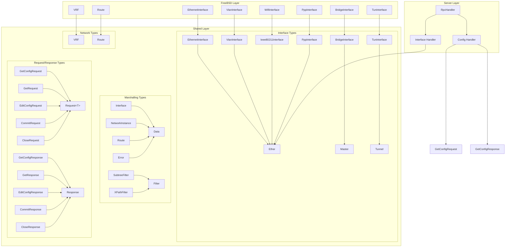
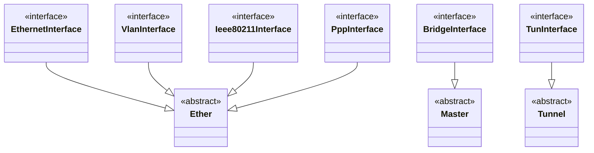
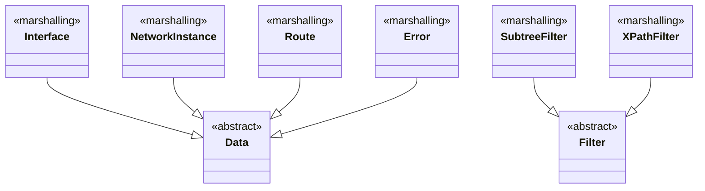
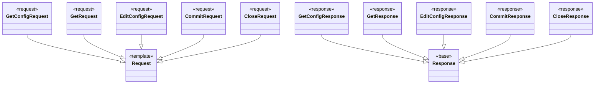

# Type Hierarchy Documentation

This document describes the complete type hierarchy for the netd project, including interfaces, VRF, routes, marshalling types, and their relationships.

## Overview

The netd project uses a layered architecture with multiple type hierarchies:

- **Shared Layer**: Defines base types for interfaces, VRF, routes, and marshalling
- **FreeBSD Layer**: Provides FreeBSD-specific implementations
- **Server Layer**: Uses shared types for NETCONF operations
- **Marshalling Layer**: Handles data serialization and YANG conversion

## Complete Type System Overview



## Shared Interface Type Hierarchy

The shared layer defines three main base interface types:



## VRF Type Hierarchy

VRF (Virtual Routing and Forwarding) types:

```mermaid
classDiagram
    class VRF {
        <<shared>>
    }

    class VRF {
        <<FreeBSD Implementation>>
    }

    VRF --|> shared::VRF
```

## Route Type Hierarchy

Route types:

```mermaid
classDiagram
    class Route {
        <<shared>>
    }

    class Route {
        <<FreeBSD Implementation>>
    }

    Route --|> shared::Route
```

## Marshalling Type Hierarchy

Marshalling types for data serialization and YANG conversion:



## Request/Response Type Hierarchy

NETCONF request and response types:



## FreeBSD Interface Type Hierarchy

The FreeBSD layer provides concrete implementations of the shared interfaces:

```mermaid
classDiagram
    class EthernetInterface {
        <<FreeBSD Implementation>>
    }

    class BridgeInterface {
        <<FreeBSD Implementation>>
    }

    class VlanInterface {
        <<FreeBSD Implementation>>
    }

    class WifiInterface {
        <<FreeBSD Implementation>>
    }

    class PppInterface {
        <<FreeBSD Implementation>>
    }

    class TunInterface {
        <<FreeBSD Implementation>>
    }

    %% Inheritance relationships
    EthernetInterface --|> shared::interface::EthernetInterface
    BridgeInterface --|> shared::interface::BridgeInterface
    VlanInterface --|> shared::interface::VlanInterface
    WifiInterface --|> shared::interface::Ieee80211Interface
    PppInterface --|> shared::interface::PppInterface
    TunInterface --|> shared::interface::TunInterface
```

## Interface Discovery Flow

The interface discovery system follows this flow:

```mermaid
flowchart TD
    A[Server Layer] --> B[Ether::getAllInterfaces()]
    B --> C[EthernetInterface::getAllEthernetInterfaces()]
    B --> D[BridgeInterface::getAllBridgeInterfaces()]
    B --> E[VlanInterface::getAllVlanInterfaces()]
    B --> F[WifiInterface::getAllWifiInterfaces()]
    B --> G[PppInterface::getAllPppInterfaces()]
    B --> H[TunInterface::getAllTunInterfaces()]
    
    C --> I[getifaddrs() - em*, igb*, ix*, bge*, re*, fxp*]
    D --> J[getifaddrs() - bridge*, br*]
    E --> K[getifaddrs() - vlan*]
    F --> L[getifaddrs() - wlan*, ath*]
    G --> M[getifaddrs() - ppp*]
    H --> N[getifaddrs() - tun*]
    
    I --> O[Return EthernetInterface objects]
    J --> P[Return BridgeInterface objects]
    K --> Q[Return VlanInterface objects]
    L --> R[Return WifiInterface objects]
    M --> S[Return PppInterface objects]
    N --> T[Return TunInterface objects]
    
    O --> U[Convert to Ether objects]
    P --> V[Convert Master to Ether objects]
    Q --> W[Convert to Ether objects]
    R --> X[Convert to Ether objects]
    S --> Y[Convert to Ether objects]
    T --> Z[Convert Tunnel to Ether objects]
    
    U --> AA[Return vector of Ether objects]
    V --> AA
    W --> AA
    X --> AA
    Y --> AA
    Z --> AA
```

## Interface Type Classification

### Ether Types (Base Interface Type)
These interfaces inherit from `netd::shared::interface::base::Ether`:

- **EthernetInterface**: Physical ethernet interfaces (em*, igb*, ix*, bge*, re*, fxp*)
- **VlanInterface**: VLAN interfaces (vlan*)
- **WifiInterface**: Wireless interfaces (wlan*, ath*)
- **PppInterface**: PPP interfaces (ppp*)

### Master Types (Interface Management)
These interfaces inherit from `netd::shared::interface::base::Master`:

- **BridgeInterface**: Bridge interfaces (bridge*, br*)

### Tunnel Types (Tunneling Interfaces)
These interfaces inherit from `netd::shared::interface::base::Tunnel`:

- **TunInterface**: TUN interfaces (tun*)
- **TODO**: VXLAN, WireGuard, TAP interfaces

## Interface Discovery Functions

Each FreeBSD interface class provides a static discovery function:

| Interface Type | Discovery Function | Return Type | Name Patterns |
|----------------|-------------------|-------------|---------------|
| Ethernet | `getAllEthernetInterfaces()` | `vector<EthernetInterface>` | em*, igb*, ix*, bge*, re*, fxp* |
| Bridge | `getAllBridgeInterfaces()` | `vector<BridgeInterface>` | bridge*, br* |
| VLAN | `getAllVlanInterfaces()` | `vector<VlanInterface>` | vlan* |
| WiFi | `getAllWifiInterfaces()` | `vector<WifiInterface>` | wlan*, ath* |
| PPP | `getAllPppInterfaces()` | `vector<PppInterface>` | ppp* |
| TUN | `getAllTunInterfaces()` | `vector<TunInterface>` | tun* |

## Type Conversion

The main `Ether::getAllInterfaces()` function performs type conversion:

- **Ether types**: Direct conversion (already Ether objects)
- **Master types**: Convert to Ether objects by creating new Ether instances with interface name
- **Tunnel types**: Convert to Ether objects by creating new Ether instances with interface name

This ensures that the server layer always receives a unified list of `Ether` objects regardless of the underlying interface type.

## Future Extensions

The system is designed to be extensible. To add new interface types:

1. Create the shared interface class inheriting from `Ether`, `Master`, or `Tunnel`
2. Create the FreeBSD implementation class
3. Add the discovery function to the FreeBSD class
4. Update `Ether::getAllInterfaces()` to include the new interface type
5. Add appropriate name pattern matching in the discovery function

## Dependencies

- **System Calls**: All system calls (`getifaddrs()`, `ioctl()`) are contained in the FreeBSD layer
- **Server Layer**: Uses only the shared interface types, no direct system calls
- **Type Safety**: Strong typing ensures proper interface handling and prevents type confusion
